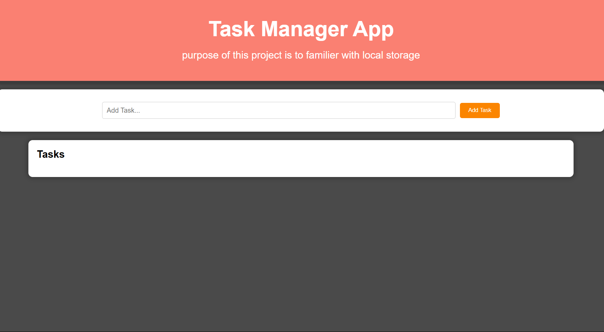

# Task Manager

This project is a web-based task management application built using HTML, CSS, JavaScript, and an API. It provides a user-friendly interface for creating, organizing, and managing tasks.

Features:

Task Creation: Users can add new tasks with a title, description, and optional due date.
Task Management: Users can view, edit, mark tasks as complete, and delete them.
Task Organization: Implement features like:
Priority Levels: Assign priority levels (high, medium, low) to tasks for better organization.
Categories/Tags: Allow users to categorize tasks with tags or add them to different lists for better grouping.
Persistence: (This requires the API) Store tasks on a server-side database so they persist even after the browser is closed.
User Interface:
Clean and user-friendly design using HTML and CSS.
Responsive design for optimal viewing on different devices.
Technology Stack:

Frontend:
HTML: Structure the content and layout of the application.
CSS: Style the application for visual appeal and responsiveness.
JavaScript: Handle user interactions, manipulate the DOM, and potentially interact with the API for data persistence.
Backend (API): This project description focuses on the frontend, but to persist tasks beyond browser sessions, you'll need an API on the backend. You can choose from various options like:
Node.js with Express for a JavaScript-based backend.
Python with Flask or Django for a Python-based backend.
Additional Considerations:

Search Functionality: Allow users to search for specific tasks using keywords or tags.
Sorting: Allow users to sort tasks by various criteria like due date, priority, or completion status.
Benefits:

This task manager application helps users:

Improve productivity and organization.
Prioritize tasks effectively.
Track progress and deadlines.
Manage tasks from any device with a web browser.
Future Enhancements:

User accounts and authentication for personalized task management.
Real-time updates and notifications.
Collaboration features for shared task management.

## Appendix

API Functionality:

The API should expose functionalities for:

Task CRUD Operations (Create, Read, Update, Delete):

Create: Allow adding new tasks with title, description, priority (if applicable), category (if applicable), and due date (if applicable).
Read: Retrieve all tasks, specific tasks by ID, or filter tasks based on criteria (e.g., priority, completion status).
Update: Allow users to edit existing tasks.
Delete: Allow users to remove tasks.
API Integration with Frontend:

The JavaScript code in your frontend will interact with the API for data persistence.

## Authors

- [@Ravi Panchal](https://github.com/saneinfringer)

## Color Reference

| Color             | Hex                                                                |
| ----------------- | ------------------------------------------------------------------ |
| Example Color |  #4a4a4a |
| Example Color |  #fff |

## Demo

https://saneinfringer.github.io/Task-Manager/

## Features

Task Creation: Users can add new tasks with a title, description, and optional due date.

Task Management: Users can view, edit, mark tasks as complete, and delete them.

User Interface:
Clean and user-friendly design using HTML and CSS.
Responsive design for optimal viewing on different devices.

## Lessons Learned

Event Listening Optimization:
Debouncing or throttling event listeners can significantly reduce unnecessary function calls and improve performance when handling frequent battery level changes.
Removing event listeners when no longer needed conserves resources, especially for applications that only require battery information temporarily.
Data Structure Selection:
Utilizing efficient data structures like arrays or typed arrays (e.g., Float32Array) is crucial for storing and retrieving battery data (e.g., historical level information) with speed and memory optimization.
Power-Saving UI Practices:
Minimizing DOM manipulations and employing techniques like requestAnimationFrame or virtual DOM libraries (e.g., React, Vue) help minimize browser reflows and enhance UI rendering efficiency.
Exploring lighter UI representations, such as CSS animations or SVGs, can further reduce rendering overhead compared to complex HTML elements.
Browser-Specific Optimization:
For Android apps, leveraging the WorkManager API can ensure efficient scheduling of asynchronous tasks related to battery data, potentially improving battery life.
Testing and Profiling:
Thorough testing under various battery levels (full charge, critically low) is essential to identify and address potential performance issues or unexpected behavior.
Utilizing browser developer tools for profiling helps pinpoint performance bottlenecks in your code, allowing you to focus optimization efforts on the most impactful areas.

## Optimizations

User Experience:

Intuitive Interface: Design a clean and user-friendly interface with easy-to-understand controls. Consider user testing to identify and address any usability issues.

Frontend:
HTML: Structure the content and layout of the application.
CSS: Style the application for visual appeal and responsiveness.
JavaScript: Handle user interactions, manipulate the DOM, and potentially interact with the API for data persistence.

## Screenshots

## License

[MIT](https://choosealicense.com/licenses/mit/)

## Feedback

If you have any feedback, please reach out to us at xiansfactor@gmail.com

## Support

For support, email xiansfactor@.com or join on instagram @v8_m5_cs.

